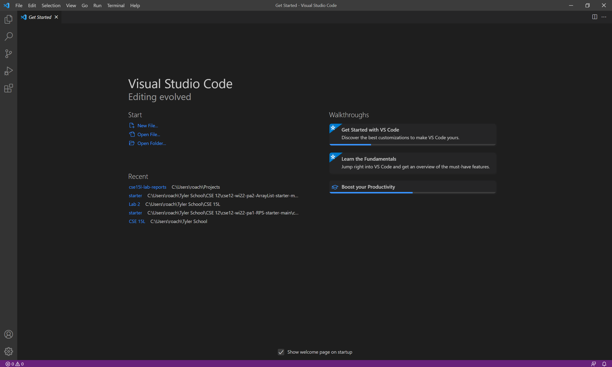
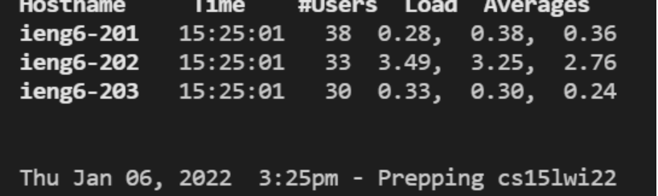
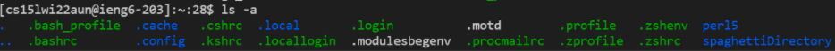
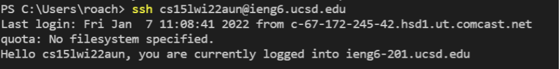

## Week 1 Lab Report

During week one, we spent our lab time setting up our coding environments and worked on creating an easy-to-use remote environment. 

### **Step 1**: Download VSCode.
 Super easy first step, you just have to go to 
[this link]( https://code.visualstudio.com) and click download.


After finishing the download process and opening up VSCode, you should see an environment similar to this



### **Step 2**: Remote Connection
Firstly, we have to get OpenSSH installed. Using
[this](https://docs.microsoft.com/en-us/windows-server/administration/openssh/openssh_install_firstuse) link, install OpenSSH. 

Then, use [this](https://sdacs.ucsd.edu/~icc/index.php) link to get to the UCSD course account lookup page, where you can find your cs 15L account. 

It looks like cs15lwi22zz@ieng6.ucsd.edu, but zz is replaced with a unique combination, either 2 or 3 letters long. 

Given that this is directed toward past me, I'm going to write each command using my actual account.

When inside VSCode, you can click a Terminal button on the top left. Then hit Open New Terminal. From that new terminal, you can use regular commandline commands.

For example, type 

```
ssh cs15lwi22aun@ieng6.ucsd.edu
```
into the command line to attempt to login to the IENG6 Servers.

It's gonnas ask if you want to recongize this network, and the answer is yes!


After you put your password in, which is just your triton password, it should look like this



Now, you can run some fun commands!
```
cd, ls, mkdir, cp, cat
```
are all good examples of commands to mess around with. Personally, I used 

`ls - a`

and got this fun result




doing `-a` shows some of the hidden dotfiles, as well as the rest of the files. 

### **Step 3**: Copying Files

Now, you need to move commands from the client(local) to the server(remote). To do this, you're going to use the `scp` command, which will copy and paste files into the remote. 

The syntax looks like this

```
scp filename.java cs15lwi22aun@ieng6.ucsd.edu:~/
```

It should ask you for your password again, then if you log back in to the server with ssh, and use the ls command, you should be able to see your file in the server

Yay! Copying the file worked. Now we deal with the huge pain that is your password. Typing in the password every time you want to move a file or get into the system is a huge pain, so we are going to create something called an SSH key. 

/*
### **Step 4:** SSH Keys and optimization 
The section about setting up an ssh key 
*/




After you've set up your key, then you can get into the realm of optimizing!


You can write code after your command line ssh 

